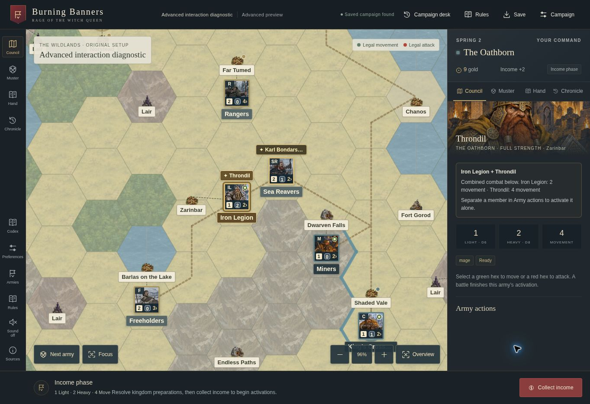

# Map camera audit — October 5, 2026

## Finding and change

The map rebuilt its SVG and marker layer after every selection or panel change,
then waited for `requestAnimationFrame` to apply the existing camera. Restoring a
campaign with no camera added a second deferred step: first fit the map, then
paint it. This exposed an untransformed map and temporary missing counters before
the first painted frame.

`render()` now cancels an obsolete queued camera paint, fits a new camera
synchronously when necessary, and paints the newly mounted map before returning.
Discrete Zoom in and Zoom out commands also paint synchronously. Wheel zoom,
dragging, and pinch gestures retain their coalesced animation-frame updates.

The zoom button handlers return before the general UI-render branch; they do not
select a hex or rebuild the map. Pointer gesture handling excludes the map
controls and navigation controls.

## Browser observations

An isolated real Chrome preview tab restored the Advanced diagnostic save through
the regular Continue control. Before the change, the immediate accessibility
observation had no visible map counters and a placeholder 100% zoom label. After
the render change, the same immediate observation included the counters, the
actual 96% label, a non-empty SVG transform, and all five camera presentation
attributes on the map container.

After synchronous button painting, a single observed Zoom in followed by an
observed Zoom out immediately restored the rendered camera width exactly:
1013.820 → 811.056 → 1013.820, with the visible label changing 96% → 120% → 96%.
The final SVG transform also matched the starting transform. The strict
TypeScript build passed after the fixes. Earlier rapid cloud-browser batches
produced delayed DOM/paint observations and inconsistent native click targeting;
those observations are not treated as proof of smooth physical-device interaction.

The audit uses only rendered DOM measurements and native browser input. It does
not inject game state or camera values. Real touchscreen pinch behavior still
requires a physical-device check.

## Compact Hero stacks

Attached Heroes now appear as a named gold badge above their Army tile. Their
separate map counters are omitted; lone Heroes retain a full counter. The Army
button's accessible name and title include every attached Hero, and selecting a
Hero through the roster highlights the shared map tile. The roster and stack
detail controls still expose the individual members. Overview zoom reduces the
unselected badge to a gold star to limit clutter.

The Advanced diagnostic browser save produced six visible Army markers rather
than eight separate Army/Hero markers. Rendered DOM measurements confirmed both
Hero badges were centered over their tiles with a 5 px gap. Selecting Throndil
through the Council roster opened his details and highlighted Iron Legion's
shared tile. The marker collision cache and mobile focus measurements now include
the badge. Strict TypeScript build passed.

