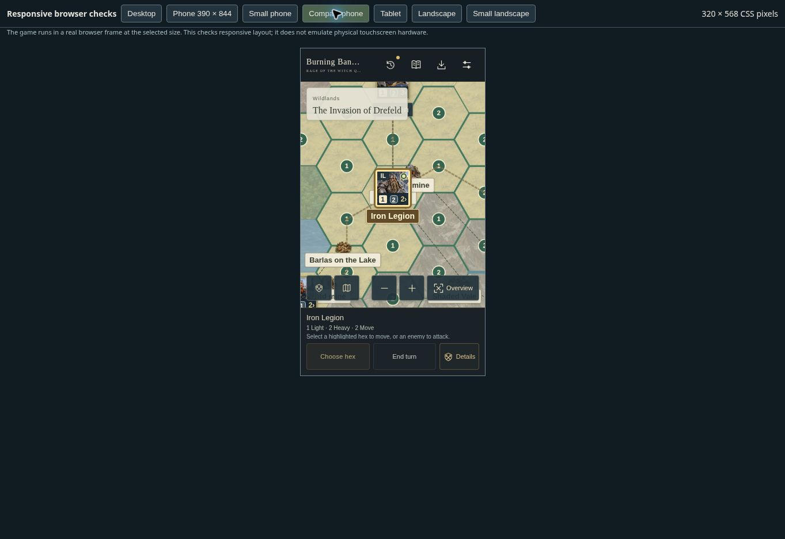
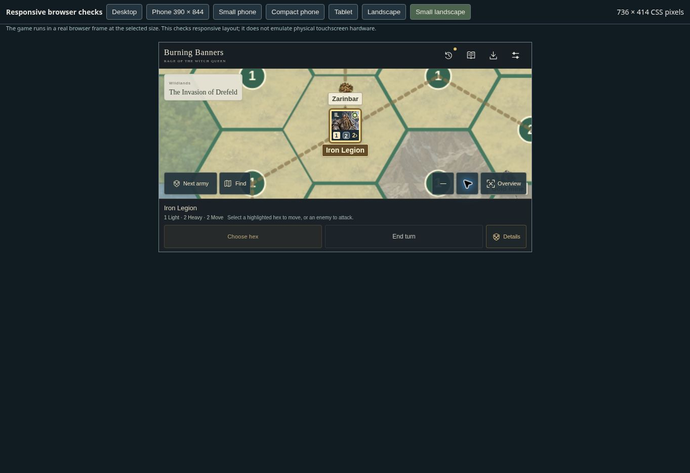
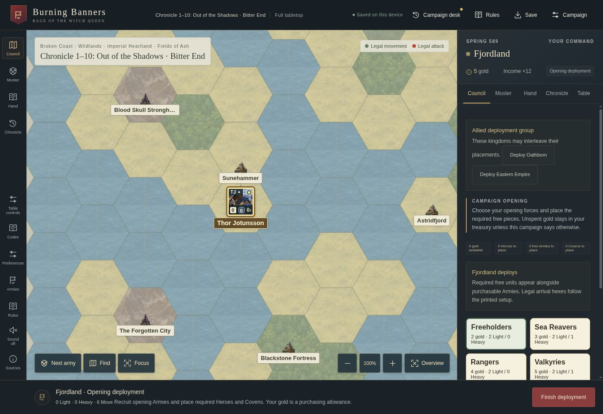
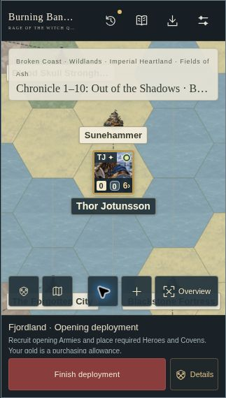

# Campaign browser verification

Checked the managed browser preview on 5 October 2026, using the actual game UI.

Desktop checks covered the official introductory opening, paid deployment and treasury changes, human handoff/reveal, the linked six-kingdom Chronicle selector, final Bitter End objectives, and its starting Control choice. The source campaign selector includes the introduction, 17 Scrolls campaigns, ten Chronicle starts, and the full 35-season mode. All six introductory objective locations are visible in the overview; the four-board map uses the joined source geometry.

Mobile checks used real browser frames at 390×844, 360×740, 320×568 and 736×414 CSS pixels. These dimensions exercise responsive layout; they do not emulate physical touchscreen hardware.

- Completed both players' introductory purchases and placement, handoff curtains, return briefings and Oathborn income collection.
- Opened and closed the detail drawer, searched for Iron Legion, focused its counter, and zoomed twice at each size. The map stayed filled and workspace `scrollTop` remained zero.
- Used keyboard and drag panning; both changed the camera without scrolling the application workspace.
- Verified separate 44px compact navigation targets. At 320px, Find ends at x102 and the zoom controls begin at x123.
- Checked the full campaign selector, linked ending-chapter/Bitter End controls, scrolling setup dialogs, backup dialog and copy-text fallback.
- Motion Off removed sampled button transitions and persisted across reload. Follow Device Setting also persisted. The browser reported its system reduced-motion preference as false, so the true system-preference branch was not physically exercised.

Two observed layout defects were fixed: hidden workspace scrolling after focus shifted the board out of view; compact Find overlapped Zoom Out. `overflow:clip` removes the unintended scroll container, and compact navigation uses icon buttons with accessible labels.

Rules and map qualifications are documented in [the source audit](campaign-map-audit.md). Engine checks and AI playtests are separate from these browser checks.

## Final joined-map and table-ruling pass

The final UI build resumed the linked 35-season Advanced save with Thor Jotunsson at Sunehammer, retained the five-gold opening treasury, and showed the correct return briefing. Enabling Full tabletop required an explicit reason, preserved the board and Hero readiness, inserted four missing manual Magic cards, and recorded the change in the briefing. The same save resumed on a 320×568 frame. Its Table controls dialog measured 296px wide, with no horizontal overflow; the mobile drawer exposed the Table button. Closing the drawer and zooming in/out kept workspace scroll at zero and width at 320px.

